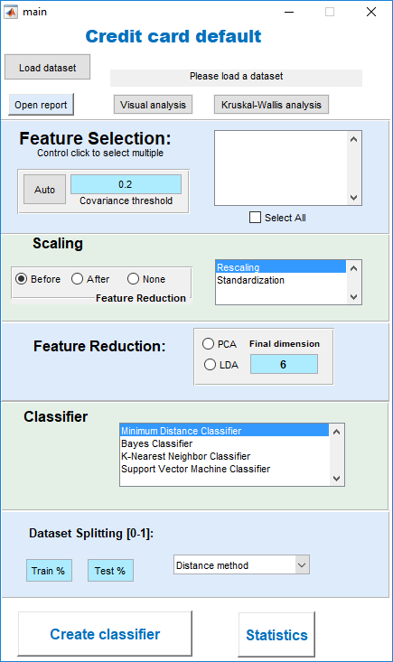

# Predicting default of credit card payment

This project was done in a introductory course to machine learning
for my Master's degree. This GUI should work for other datasets but 
guarantees are made.
The assignment was to create a simple GUI that implemented
all the ML techniques we learned during the semester. 

If you know a bit about machine learning you should find
the GUI easy to follow.

The report is supposed to be small but there you can find a summary
of all the techniques applied as well as results for several
combinations of methods.

# How to run
1. Due to external dependencies you need to run *startup.m* to load those dependencies into the
Matlab environment.
2. Run *main.m* to start the program.

# The interface

Upon initializing the program, the window below should prompt.
It contains all the basic steps of a typical ML project:
1. Fast visual analysis of the dataset for exploratory data analysis.
2. Feature selection
    1. A statistical method to help manually perform feature selection (Kruskal-Wallis)
    2. What we call "Auto" feature selection is simply 
    the removal of features that have a degree of covariance
    higher than the specified threshold.
    3. Manual selection from the list of features
3. Feature scaling
    1. One can scale the features before or after applying feature reduction
4. Feature reduction
    1. Principal component analysis (PCA).
    2. Linear discriminant analysis (LDA).
5. Classifier
    1. Minimum distance
    2. Naive Bayes
    3. K-nearest neighbor (KNN)
    4. Support Vector Machine (SVM)

**Load dataset**: Upon loading the dataset, as a excel file,
we extract the name of the features and display them.
The feature selection panel supports multiclick and so it allow
users to manually select the best features.

**Visualize data:** To visualize our data click *visual analysis* and
you will be prompted with a new window where you can see some
simple boxplots of all the features, their covariance and
an analysis of the features using several hierarchical clustering
methods.

**Kruskal-wallis test**: To run the kruskal-wallis test on the
selected features you can press the button and a new window will
show you the correlation of each feature and the desired output.

**Classifier settings:** As the GUI was supposed to be simple
to use we did not include many hyperparameters for the classifiers. 
The only hyperparameters the user can change are the metric distance
to use for the Minimum Distance Classifier and the number of neighbors
to consider in KNN.

**Training:** We split the dataset in two randomly assigned groups.
The first groups contains 70% of the data and is used to train the
model. The rest is used to test the accuracy and other performance
metrics. Our GUI shows the accuracy, the confusion matrix
 and the roc curve.
 Best configuration found for this dataset is shown below.
 
 
 
 
 
